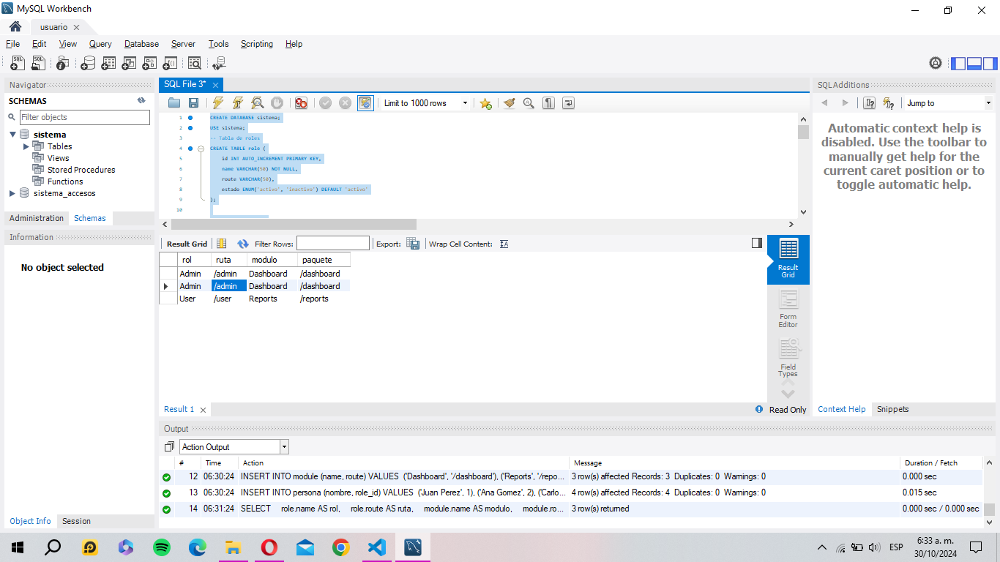

Consulta para obtener vistas y módulos a los que tiene acceso un rol en estado activo
Descripción:
Esta consulta tiene como objetivo obtener la lista ordenada de vistas y módulos a los que un rol tiene acceso, considerando únicamente aquellos en estado activo. Los resultados están ordenados por un atributo especificado.

```js
CREATE DATABASE sistema;
USE sistema;
-- Tabla de roles
CREATE TABLE role (
    id INT AUTO_INCREMENT PRIMARY KEY,
    name VARCHAR(50) NOT NULL,
    route VARCHAR(50),
    estado ENUM('activo', 'inactivo') DEFAULT 'activo'
);

-- Tabla de módulos
CREATE TABLE module (
    id INT AUTO_INCREMENT PRIMARY KEY,
    name VARCHAR(50) NOT NULL,
    route VARCHAR(50)
);

-- Tabla de personas
CREATE TABLE persona (
    id INT AUTO_INCREMENT PRIMARY KEY,
    nombre VARCHAR(50) NOT NULL,
    role_id INT,
    FOREIGN KEY (role_id) REFERENCES role(id)
);
-- Insertar datos en la tabla role
INSERT INTO role (name, route, estado) VALUES 
('Admin', '/admin', 'activo'),
('User', '/user', 'activo'),
('Guest', '/guest', 'inactivo');

-- Insertar datos en la tabla module
INSERT INTO module (name, route) VALUES 
('Dashboard', '/dashboard'),
('Reports', '/reports'),
('Settings', '/settings');

-- Insertar datos en la tabla persona
INSERT INTO persona (nombre, role_id) VALUES 
('Juan Perez', 1),
('Ana Gomez', 2),
('Carlos Ruiz', 1),
('Maria Lopez', 3);

SELECT
    role.name AS rol,
    role.route AS ruta,
    module.name AS modulo,
    module.route AS paquete
FROM
    persona p
    INNER JOIN role ON p.role_id = role.id
    INNER JOIN module ON role.id = module.id
WHERE
    role.estado = 'activo'
ORDER BY
    role.name;


```
Explicación de la consulta
Selección de columnas: La consulta selecciona los nombres y rutas de role y module.
Joins: Utiliza INNER JOIN para relacionar las tablas role y module con persona.
Filtro: Se filtran los roles que están en estado activo (role.estado = 'activo').
Orden: Los resultados se ordenan alfabéticamente por el nombre del rol (role.name).


